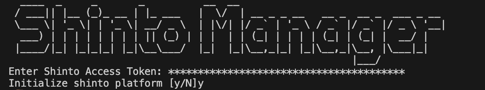

Shinto CDK CICD Platform
=============

**Transform DevOps Team** from IAC delivery (deploying "standard" template) to Platform Enablement Team. Shinto is an extensible framework, allowing platform teams to standardize CICD processes and deployments across the enterprise.

- Integrates with AWS Control Customizations via Event Bridge
- Easily add Software-as-a-Service (SaaS) vendors or new pipeline stages

**The Shinto Advantage**
- Fully automated CI/CD
- Accelerate delivery 
- Reduce negative impacts of manual scripting
- Repeatable consistent deployments across multiple environments
- Turnkey application packaging 
- Integrated Quality and Security Scans
- Simplified Disaster Recovery

**Installation**

<ins>Prerequisites</ins>
> - [AWS CLI Version 2.11.6 or greater](https://docs.aws.amazon.com/cli/latest/userguide/getting-started-install.html)
> - [Node.js Version 18.16 or greater](https://nodejs.org/en/download)
> - [Docker Version 24.0.2 or greater](https://docs.docker.com/engine/install/)
> - [AWS CDK Version 2.81.0 or greater](https://aws.amazon.com/getting-started/guides/setup-cdk/module-two/)
> - Shinto Access Token (email: mark@mrwconsulting.tech)

[Verify prerequisites](https://github.com/mrwconsulting/shinto-samples/assets/82276384/e28a80f7-a7ad-4dcf-ade1-b2edc47ed68c)

<ins>Steps</ins>
1. Request Shinto Access Token (email: mark@mrwconsulting.tech)
2. Create git repository for shinto samples (https://github.com/mrwconsulting/shinto-samples.git)
>> [How-To create repo and clone samples](https://github.com/mrwconsulting/shinto-samples/assets/82276384/0a7bc586-010e-4cee-871b-ef919f086499)

3. Update .npmrc file with Shinto Access Token
>> 

4. Install Shinto Manager (npm install @mrwconsulting/shinto-manager --global)
>>[How-To install shinto-manager details](https://github.com/mrwconsulting/shinto-samples/assets/82276384/63528b99-b2d0-42e6-a077-4bf7e02d9071)

5. Access AWS Console, create codestar connection to git repository
>> [How-To setup CodeStart Connection](https://github.com/mrwconsulting/shinto-samples/assets/82276384/1a5575dd-399f-4ddd-9224-41fdfaa0a194)

6. Install Shinto Platform
   ```
    > cd shinto-samples/extras
    > [update install.json with you account specific information]
    > shinto-manager install --profile shinto-manager
    
   ```
7. Enter Shinto Access Token received from (email: mark@mrwconsulting). Follow the prompts



**Shinto Framework** is an accelerator for DevOps teams for CDK-based pipelines. CICD Pipeline is the reference implementation for self-service AWS CodePipeline. Development teams submit a property file to the service to register a CDK pipeline. This will kick off the creation of the pipeline. In addition, pipeline will self-configure (mutate) based on different values and attributes set within a property file.


**Quality Gates** (Code Coverage) are verifications inside the CICD pipeline to prevent code from moving forward if it doesn't meet the specified quality criteria. Some examples are below:

- Finding what parts of code are covered by tests
- Finding what parts of code are not covered by tests
- Remove dead code.

> CDK CICD Pipeline supports following quality gates:
>> - [Codacy](https:www.codacy.com)
>> - [Snyk](https://snyk.io/)

>>*Shinto Framework can easily be updated to support other vendor implementations*

[Generate Shinto Token](https://github.com/mrwconsulting/shinto-samples/assets/82276384/f69c277b-e9d5-4c69-8bf8-d382e69755c1)

[Pipline deployment overview](https://github.com/mrwconsulting/shinto-samples/assets/82276384/a14122b9-1487-4be7-8062-be93672eebf2)

**Containerize Applications** (no more writing dockerfiles)—build optimized docker images for applications without deep mastery of docker best-practices.
- Fast - Deploy changes quickly by separating applications into multiple layers, splitting dependencies from classes.
- Reproducible - Rebuilding a container image with the same contents always generates the same image. Never trigger an unnecessary update again.

> CDK CICD Pipeline supports following docker image building technologies: 
>> - [Cloud Native Buildpacks](https://buildpacks.io/)
>> - [Google JiB](https://cloud.google.com/java/getting-started/jib)

>>*Shinto Framework can easily be updated to support other vendor implementations*

[Sample Application Configuration Overview](https://github.com/mrwconsulting/shinto-samples/assets/82276384/b274c79f-5ddc-4c85-8435-a95bca77904e)

[Sample Application Pipeline Overview](https://github.com/mrwconsulting/shinto-samples/assets/82276384/dd724622-3476-4cc8-9912-d8de5275394a)

